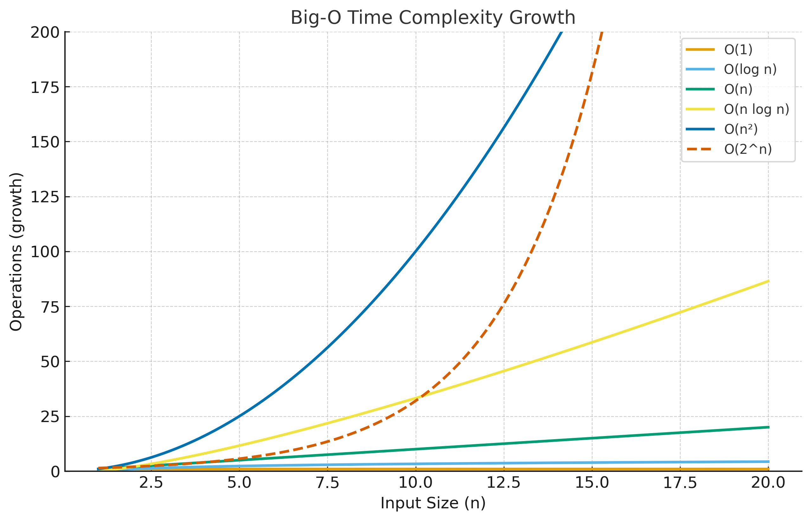

# Time & Space Complexity Notes

## Big-O Growth Chart

1. What is Time Complexity?

It measures how the runtime of an algorithm grows as the input size (n) increases.

Expressed in Big-O notation (worst case), sometimes Big-Θ (average), Big-Ω (best case).

2. Common Time Complexities
Complexity	Name	Example
O(1)	Constant	Accessing array element, hash lookup
O(log n)	Logarithmic	Binary Search, Tree height traversal
O(n)	Linear	Traversing array, finding max
O(n log n)	Linearithmic	Merge Sort, Quick Sort (avg)
O(n²)	Quadratic	Nested loops (Bubble Sort, Insertion Sort)
O(n³)	Cubic	Triple nested loops
O(2^n)	Exponential	Recursion on subsets, Fibonacci naive
O(n!)	Factorial	Generating all permutations

📌 Rule of thumb:

n ≤ 10^6 → O(n) is fine

n ≤ 10^4 → O(n²) may work

Beyond → need O(log n), O(n log n)

3. Time Complexity Examples
// O(1) → Constant
let x = arr[0];

// O(n) → Linear
for (let i = 0; i < n; i++) console.log(i);

// O(n²) → Nested loop
for (let i = 0; i < n; i++) {
  for (let j = 0; j < n; j++) console.log(i, j);
}

// O(log n) → Binary Search
function binarySearch(arr, target) {
  let l = 0, r = arr.length - 1;
  while (l <= r) {
    let mid = Math.floor((l + r) / 2);
    if (arr[mid] === target) return mid;
    else if (arr[mid] < target) l = mid + 1;
    else r = mid - 1;
  }
  return -1;
}

4. What is Space Complexity?

Measures memory usage of an algorithm:

Variables

Input/Output storage

Data structures

Recursion stack

5. Common Space Complexities
Complexity	Example
O(1)	Iterative algorithms (no extra DS)
O(n)	Hashmap, extra arrays
O(log n)	Recursion depth in binary search / tree
O(n²)	2D DP table, adjacency matrix
6. Space Complexity Examples
// O(1) → Only few variables
let sum = 0;  

// O(n) → Extra array
let copy = [...arr];  

// O(n) → Recursion stack (depth n)
function fact(n) {
  if (n === 0) return 1;
  return n * fact(n-1);
}

7. Trade-offs

Time vs Space:

Using extra memory (hashing, memoization) can reduce time.

Example: Fibonacci DP (O(n) space → O(n) time vs naive recursion O(2^n) time).

8. Quick Cheatsheet

Best: O(1) → O(log n) → O(n) → O(n log n)

Okay: O(n²) (for n ≤ 10³–10⁴)

Avoid: O(2^n), O(n!) (only for small n in recursion/backtracking)